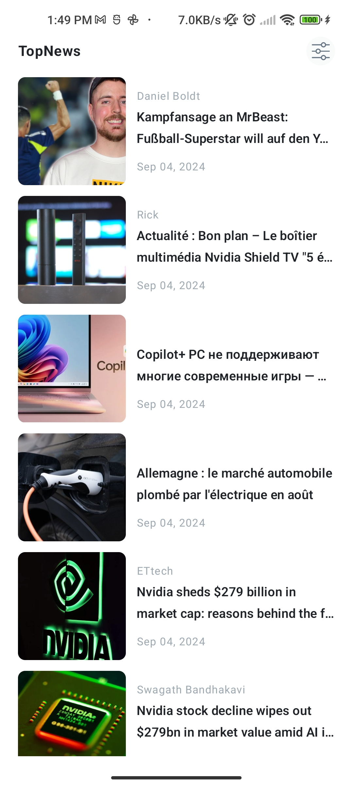
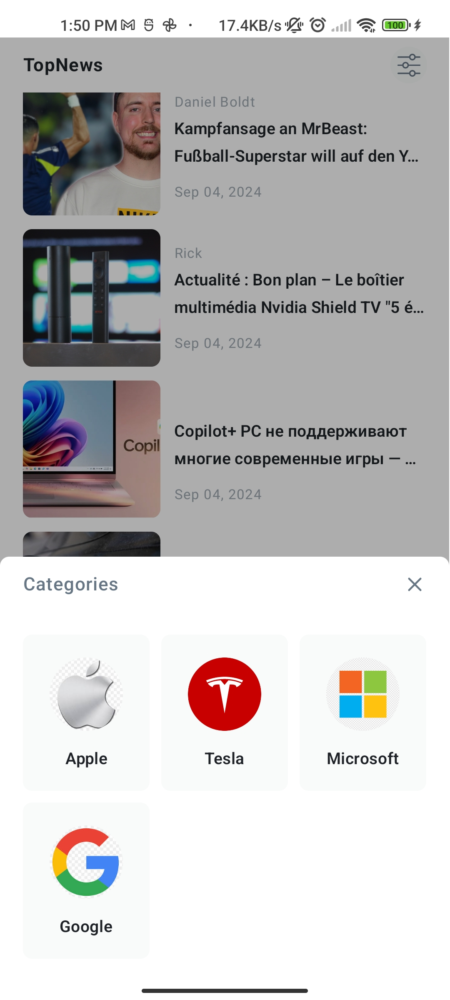

# Top News App

## Overview

This project is a news aggregator application that fetches and displays top headlines in the US from various sources, specifically focusing on companies like Microsoft, Apple, Google, and Tesla. The app is built using best practices in Android development, providing a clean, responsive, and user-friendly interface.

## Objective

- Develop an application that aggregates top headlines from various sources.
- Display headlines, brief summaries, and full articles.
- Ensure the app adheres to clean architecture and follows best practices.

## App Screens

- **Home Screen:** Displays the list of news headlines with filtering options.
- **News Detail Screen:** Shows the full content of the selected news item.

  
  
  

## Key Features

1. **API Integration:**
    - Fetches news using the NewsAPI, specifically focusing on Microsoft, Apple, Google, and Tesla.
    - Retrieves news from the last two days, sorted by the newest first.
    - Efficiently handles data processing, caching for offline viewing, and maintains performance.

2. **User Interface:**
    - **Home Screen:** Displays a list of news headlines with titles, images, short summaries, query names, and publication dates.
    - **News Detail Screen:** Shows the full article or summary with additional details like the title, content, image, date, author, and source.
    - **Filter Sheet:** Users can filter news by categories (Microsoft, Apple, Google, Tesla) for a customized view.
    - Clean, navigable UI following Material Design principles, designed using Jetpack Compose.

3. **Architecture and Code Quality:**
    - Implements Clean Architecture with MVI (Model-View-Intent) pattern.
    - Built using Kotlin, Coroutines, Flow, Hilt for dependency injection, Retrofit with Moshi for networking, Room for local database management, and Paging3 for data pagination.
    - Designed with an offline-first approach, fetching data using Retrofit and storing it in a Room database for offline access.

4. **Data Handling and Performance:**
    - Efficient JSON data processing from NewsAPI.
    - Implements caching for offline viewing of previously loaded news.
    - Uses WorkManager for background tasks and refreshing data.

5. **Testing and Version Control:**
    - Unit tests for critical components using Mockito.
    - Comprehensive error handling and loading state management.

## Stack and Libraries Used

- **Programming Language:** Kotlin
- **Architecture:** Clean Architecture + MVI
- **Concurrency:** Coroutines and Flow
- **Networking:** Retrofit + Moshi
- **Dependency Injection:** Hilt
- **Local Database:** Room
- **UI Toolkit:** Jetpack Compose
- **Background Tasks:** WorkManager
- **Pagination:** Paging3